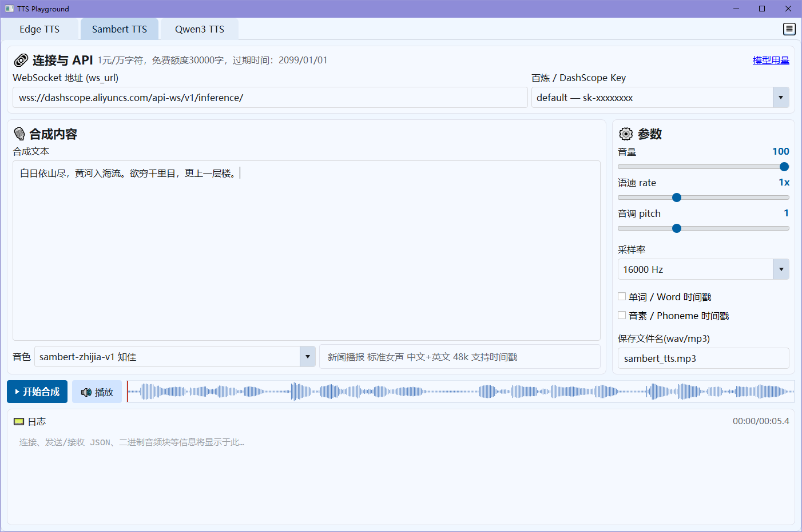
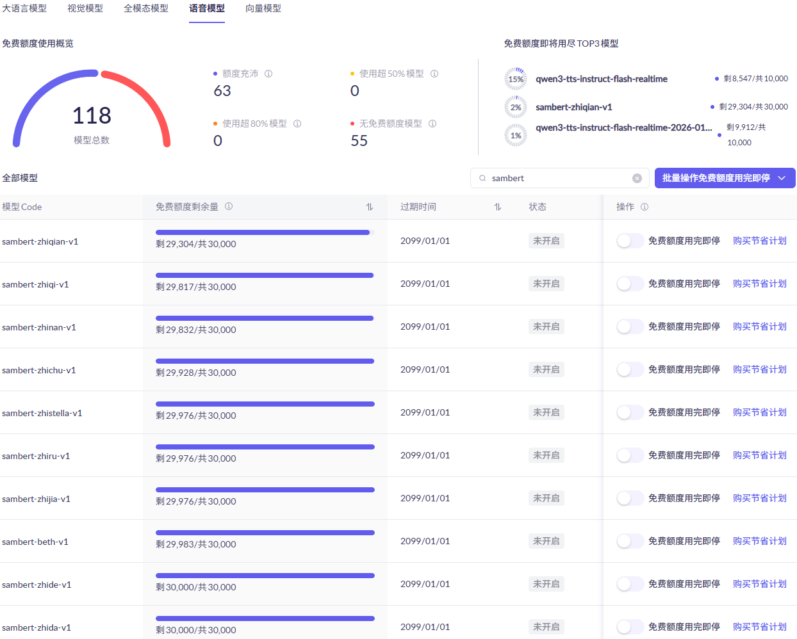

# TTS Playground

基于 PyQt5 的本地 TTS 测试工具，支持 **Edge TTS**、阿里云百炼 **Sambert TTS**、**Qwen3 TTS** 三种在线语音合成。

## 功能

| 功能 | Edge TTS | Sambert TTS | Qwen3 TTS |
|------|:--------:|:-----------:|:---------:|
| 在线合成 | ✓ MP3 | ✓ WAV/MP3 | ✓ WAV/MP3 |
| 音色选择 | ✓ ShortName 列表 | ✓ 音色 + 描述 | ✓ 模型→音色→语种联动 |
| 语速调节 | ✓ 滑块 | ✓ 滑块 | — |
| 音量/音调 | ✓ 滑块 | ✓ 滑块 | — |
| 时间戳 | — | ✓ Word/Phoneme | — |
| 语音指令 | — | — | ✓ |
| 是否免费 | 免费 | 有免费额度（至 2099 年） | 部分模型有免费额度，期限较短 |

**播放与波形**：使用 miniaudio 统一解码和播放，WAV/MP3 均无需外部编解码器；波形包络可选用 cffi/C 扩展加速（未预编译时在首次需要时尝试自动编译，若无 C 编译器则回退纯 Python）。支持点击波形任意位置跳转播放。

**界面记忆**：窗口位置/大小、字号、各 Tab 控件状态自动保存到 `user_setting.yaml`，下次启动恢复。

## 界面与用量参考

程序主界面示例（以 Sambert TTS 为例）：



在阿里云百炼控制台的「模型用量」中查看**语音模型**的剩余额度与**过期时间**（不同账号/活动可能不同）：



## 环境准备

- Python 3.10+
- 安装依赖：`pip install -r requirements.txt`

## 配置

### API Key（`bailian_api_key.yaml`）

```yaml
keys:
  - key_name: default
    bailian_api_key: sk-你的Key
```

### Edge TTS（`edge_tts.yaml`）

预置音色列表、默认语速/音量/音调。首次使用建议点击「刷新音色列表」拉取完整 ShortName。

### Sambert TTS（`sambert_tts.yaml`）

配置 WebSocket 地址和音色列表（`voice_id` / 名称 / 风格 / 语种 / 采样率 / 时间戳支持）。

### Qwen3 TTS（`qwen3_tts.yaml`）

配置 Realtime 地址、模型列表、音色、语种联动、会话模式（commit / server_commit）、采样率。

若模型名包含 `instruct`，界面自动显示「语音指令」输入框，可描述语速、语调、情感等。

### 配额与过期时间（请按自己的百炼账号修改）

仓库里 YAML 中的**免费额度、过期日期等仅作示例说明**，界面 Tab 顶部的 pricing 文案也会随 YAML 展示。**请务必以你在百炼控制台「模型用量」里、对应语音模型的「过期时间」列为准**，将内容改为你账号下的真实信息：

- **`sambert_tts.yaml`**：修改文件开头的 `info:` 整行说明（含单价、免费字数、`过期时间` 等）。
- **`qwen3_tts.yaml`**：按模型修改 `models` 下各条目中的 `note:` 字段（常含免费字符数与 `过期时间`），例如：

```yaml
  - model_id: qwen3-tts-instruct-flash-realtime
    note: 支持指令风格控制，免费10000字符，过期时间 2026/08/05
    voices:
```

保存后重启 GUI 生效。

## 运行

```bash
python run_tts_gui.py
```

标签栏右上角齿轮图标可调整全局字体大小。

## 项目结构

```
├── run_tts_gui.py          # 入口
├── gui/
│   ├── tabs/               # edge_tts / sambert_tts / qwen3_tts
│   ├── waveform.py         # 波形加载与显示
│   ├── miniaudio_player.py # miniaudio 播放器
│   └── ...                 # 常量、样式、配置等
├── edge_tts_client.py      # Edge TTS 异步封装
├── sambert_tts_ws.py       # Sambert TTS WebSocket 客户端
├── qwen3_tts_ws.py         # Qwen3 TTS WebSocket 客户端
└── *.yaml                  # 配置文件
```
